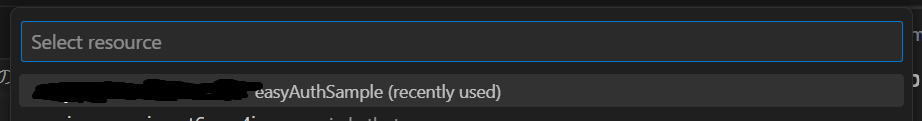
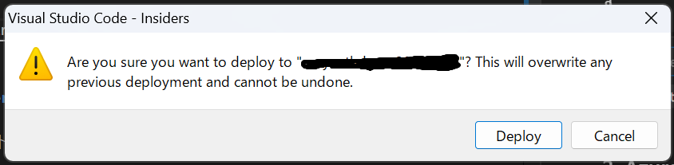

# EasyAuth で認証した場合の認証情報の取得方法 (Flask と React が共存したアプリ)

## サンプルの概要

このサンプルでは、 Azure App Service が提供する二勝機能 EasyAuth を用いて認証設定した場合に、認証されたユーザの情報を取得する方法を示します。

構成としては、 Flask (Python 3.10) と React (18) が同じ App Service 上に動作しており、 Flask がバックエンドサービス (API サーバ ) として起動し、静的なコンテンツとして、 React のアプリを返す構成です。

## 前提条件

- Azure App Service は Linux 環境で動作していること
- Azure App Service には、Python 3.10 がインストールされていること
- (オプショナル) Visual Studio Code に Azure App Service 拡張機能がインストールされていること

## サンプルの実行方法

### 全体の流れ

1. Azure App Service にサンプルコードをデプロイする
2. Azure App Service に EasyAuth の設定をする
3. ブラウザから Web サイトにアクセスする

### 1. Azure App Service にサンプルコードをデプロイする手順

Azure App Service では FTP でのアップロードや Azure CLI を用いたデプロイなどアプリを設置するための様々な方法を提供していますが、今回は Visual Studio Code を用いて設置します。

そのほかの方法で設置する場合、 [こちら](https://learn.microsoft.com/ja-jp/azure/app-service/deploy-zip?tabs=cli) を参照してください。

#### 1-1. Visual Studio Code でプロジェクトを開き、ファイルエクスプローラの「 backend 」フォルダ上にカーソルを置いて、右クリックし、コンテキストメニューから「 Deploy to Web App... 」を選択します。

#### 1-2. 画面の上部に出てくる App Service のリストの中から設置先にする App Service を選択します。

#### 1-3. 確認メッセージが表示されるので「 Deploy 」をクリックします。

#### 1-4. 設置完了後にブラウザで App Service にアクセスし、下記のように正しく表示されるかを確認します。

### 2. Azure App Service に EasyAuth の設定をする手順

詳細は [公式ドキュメント](https://learn.microsoft.com/ja-jp/azure/app-service/overview-authentication-authorization) を参照してください。今回、設定したパラメータは次の通りです。

#### 2-1. Azure AD でのアプリの登録のオブジェクトを作成します。

下記のように入力して「登録」ボタンを押します。

| パラメータ名 | 設定値 | パラメータの説明 |
| ----------- | ------ | --------------- |
| 名前 | (任意の値) | オブジェクトの名前 |
| サポートされるアカウントの種類 | この組織ディレクトリのみ | このアプリを利用できるユーザの範囲 |
| リダイレクト URI (種類) | Web | 認証するアプリの種類 |
| リダイレクト URI (値) | https://(App Service の名前).azurewebsites.net/.auth/login/aad/callback | 認証後にリダイレクトする URI |

#### 2-2. App Service での ID プロバイダを登録します。

| パラメータ名 | 設定値 | パラメータの説明 |
| ----------- | ------ | --------------- |
| ID プロバイダ | Microsoft | 認証プロバイダ |
| テナントの種類 | 従業員 | 従業員向けの Azure AD か顧客向けの Azure AD B2C かの選択 |
| アプリの登録の種類 | このディレクトリにある既存のアプリの登録を選択する | Azure AD のアプリの登録を新規作成するか既存のオブジェクトを利用するかの選択  |
| 名前またはアプリ ID | 作成したアプリの登録オブジェクト | Azure AD で定義する認証オブジェクト |
| 発行者の URL | (空欄) | Azure AD のテナント情報 (自動入力されるので入力しない) |
| アクセスを制御する | 認証が必要 | App Service アクセス時に認証を必須にするか |
| 認証されない要求 | HTTP 302 | 認証されていないアクセスの取り扱い |

#### 2-3. 設定完了後に App Service にアクセスして認証ページへリダイレクトされるかを確認します。

#### 2-4. ログイン後にブラウザで App Service にアクセスして、下記のように正しく表示されるかを確認します。

#### 2-5. ブラウザの開発者ツールを開き、その状態で「push」ボタンを押します。

開発者ツールに下記のように flask へ送られた HTTP リクエストのヘッダ情報が返ってきます。

これらの情報の中で認証に関連する情報は次のようになります。([参考](https://learn.microsoft.com/ja-jp/azure/app-service/configure-authentication-user-identities))

| ヘッダ名 | 概要 |
| -------- | --------------- |
| X-MS-CLIENT-PRINCIPAL | Base64 でエンコードされた認証情報 |
| X-MS-CLIENT-PRINCIPAL-ID | ID プロバイダーによって設定された呼び出し元の識別子 |
| X-MS-CLIENT-PRINCIPAL-NAME | ID プロバイダーによって設定された呼び出し元の人間が判読できる名前 (AAD の場合メールアドレス) |
| X-MS-CLIENT-PRINCIPAL-IDP | App Service 認証で使用される ID プロバイダーの名前 |
